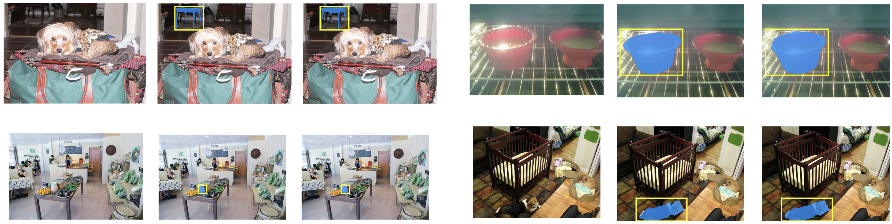

# EfficientSAM
EfficientSAM: Leveraged Masked Image Pretraining for Efficient Segment Anything

## News
[Jan.12 2024] ONNX version of EfficientSAM including separate encoder and decoder is available on the [Hugging Face Space](https://huggingface.co/spaces/yunyangx/EfficientSAM/tree/main) (thanks to @wkentaro Kentaro Wada for implementing onnx export)

[Dec.31 2023] EfficientSAM is integrated into the annotation tool, [Labelme](https://github.com/labelmeai/labelme) (huge thanks to lableme team and @wkentaro Kentaro Wada)

[Dec.11 2023] The EfficientSAM model code with checkpoints is fully available in this repository. The [example](https://github.com/yformer/EfficientSAM/blob/main/EfficientSAM_example.py) script shows how to instantiate the model with checkpoint and query points on an image.

[Dec.10 2023] Grounded EfficientSAM demo is available on [Grounded-Efficient-Segment-Anything](https://github.com/IDEA-Research/Grounded-Segment-Anything/tree/main/EfficientSAM) (huge thanks to IDEA-Research team and @rentainhe for supporting [grounded-efficient-sam demo](https://github.com/IDEA-Research/Grounded-Segment-Anything/blob/main/EfficientSAM/grounded_efficient_sam.py) under [Grounded-Segment-Anything](https://github.com/IDEA-Research/Grounded-Segment-Anything)).

[Dec.6 2023] EfficientSAM demo is available on the [Hugging Face Space](https://huggingface.co/spaces/yunyangx/EfficientSAM) (huge thanks to all the HF team for their support).

[Dec.5 2023] We release the torchscript version of EfficientSAM and share a colab.

## Online Demo & Examples
Online demo and examples can be found in the [project page](https://yformer.github.io/efficient-sam/).

## EfficientSAM Instance Segmentation Examples
  |   |   |
:-------------------------:|:-------------------------:
Point-prompt | 
Box-prompt |  
Segment everything |
Saliency | 

## Model
EfficientSAM checkpoints are available under the weights folder of this github repository. Example instantiations and run of the models can be found in [EfficientSAM_example.py](https://github.com/yformer/EfficientSAM/blob/main/EfficientSAM_example.py).

| EfficientSAM-S | EfficientSAM-Ti |
|------------------------------|------------------------------|
| [Download](https://github.com/yformer/EfficientSAM/blob/main/weights/efficient_sam_vits.pt.zip) |[Download](https://github.com/yformer/EfficientSAM/blob/main/weights/efficient_sam_vitt.pt)|

You can directly use EfficientSAM with checkpoints,
```
from efficient_sam.build_efficient_sam import build_efficient_sam_vitt, build_efficient_sam_vits
efficientsam = build_efficient_sam_vitt()
```

## Jupyter Notebook Example
The notebook is shared [here](https://github.com/yformer/EfficientSAM/blob/main/notebooks)


## Acknowledgement

+ [SAM](https://github.com/facebookresearch/segment-anything)
+ [MobileSAM](https://github.com/ChaoningZhang/MobileSAM)
+ [FastSAM](https://github.com/CASIA-IVA-Lab/FastSAM)
+ [U-2-Net](https://github.com/xuebinqin/U-2-Net)


If you're using EfficientSAM in your research or applications, please cite using this BibTeX:
```bibtex


@article{xiong2023efficientsam,
  title={EfficientSAM: Leveraged Masked Image Pretraining for Efficient Segment Anything},
  author={Yunyang Xiong, Bala Varadarajan, Lemeng Wu, Xiaoyu Xiang, Fanyi Xiao, Chenchen Zhu, Xiaoliang Dai, Dilin Wang, Fei Sun, Forrest Iandola, Raghuraman Krishnamoorthi, Vikas Chandra},
  journal={arXiv:2312.00863},
  year={2023}
}
```
